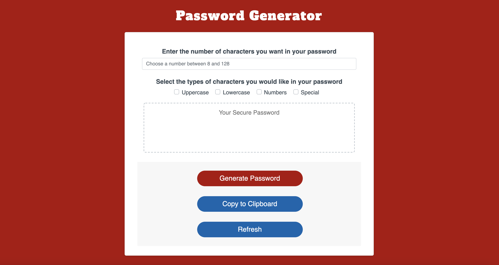

# Password Generator - submission by Michelle Watts

  ## User Story
### **AS AN** employee with access to sensitive data
### **I WANT** to randomly generate a password that meets certain criteria
### **SO THAT I** can create a strong password that provides greater security

  ## Links
### Link to the GitHub page is [here](https://michellewatts20000.github.io/password-generator/)
### Link to the GitHub repo is [here](https://github.com/michellewatts20000/password-generator)

  ## Screenshot

As Friedrich W. Nietzsche said:

> Beware that, when fighting monsters,
> you yourself do not become a monster
